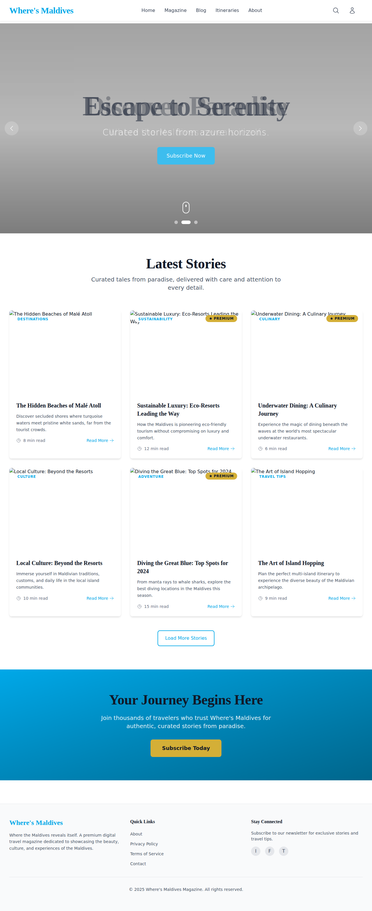
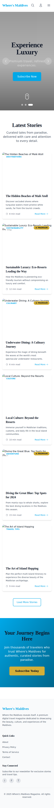

# Where's Maldives Magazine - Screenshots

This directory contains screenshots of the application showcasing the design and user interface.

## Desktop View

**File:** `homepage-desktop.png`  
**Resolution:** Full-width desktop view  
**Features Shown:**
- Fixed navigation header with logo and menu
- Full-screen hero carousel with Maldives-inspired imagery
- Content grid with article cards
- Premium badges on featured content
- Responsive layout and typography
- Footer with quick links and social media

## Mobile View

**File:** `homepage-mobile.png`  
**Resolution:** 375x667 (iPhone SE)  
**Features Shown:**
- Mobile-optimized navigation with hamburger menu
- Responsive hero section
- Stacked article cards for mobile viewing
- Touch-friendly buttons and interactions
- Mobile-first responsive design

## Design Highlights

### Color Palette
- **Azure Blue (#00A8E8):** Primary accent color, inspired by Maldivian ocean horizons
- **Refined Gold (#D4AF37):** Premium badges for exclusive content
- **Cool Gray (#F3F4F6):** Calm, serene backgrounds
- **Tidal Green (#2E8B57):** Sustainability highlights

### Typography
- **Playfair Display:** Elegant serif font for headings, creating a refined, timeless feel
- **Inter:** Clean sans-serif for body text, ensuring readability

### User Experience
- Calm, unhurried navigation
- Immersive full-screen imagery
- Curated content presentation
- Premium, ad-free interface
- Accessibility-compliant design (WCAG 2.1 AA)

## Viewing Screenshots

To view these screenshots:
1. Open the PNG files directly in this directory
2. Use any image viewer or browser
3. Screenshots are taken from the live development server running at `http://localhost:5173`

## Taking New Screenshots

To capture updated screenshots after making changes:

```bash
# Start the development server
npm run dev

# In a separate terminal, use the browser tools to navigate and capture screenshots
# Or use the Playwright browser automation tools
```

---

**Date Created:** December 16, 2025  
**App Version:** 0.0.0 (Initial Implementation)  
**Framework:** React 18 + Vite + Tailwind CSS
